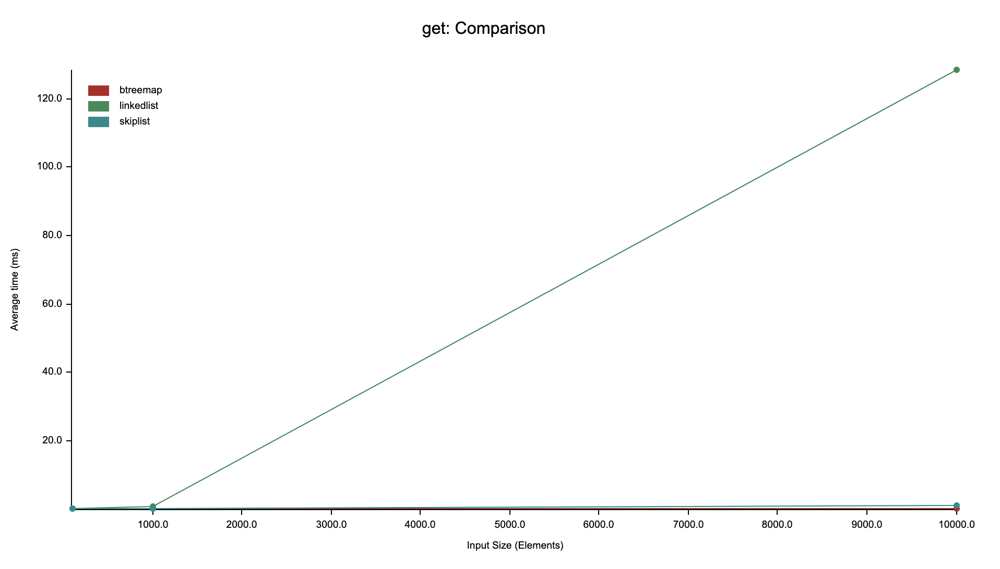

# SkipList - Rust Implementation

**⚠️ Educational Purpose Only**: This project is for learning and educational purposes only. It is not intended for production use.

A Skip List data structure implementation in Rust demonstrating probabilistic data structures and memory management concepts.

## Basic Usage

```rust
use skiplist::SkipList;

let mut skip_list = SkipList::new();

// Insert key-value pairs
skip_list.insert("apple", 1);
skip_list.insert("banana", 2);
skip_list.insert("cherry", 3);

// Retrieve values
assert_eq!(skip_list.get(&"banana"), Some(&2));

// Remove values
assert_eq!(skip_list.remove(&"banana"), Some(2));

// Iterate in sorted order
for (key, value) in &skip_list {
    println!("{}: {}", key, value);
}
// Output:
// apple: 1
// cherry: 3
```

## Performance Comparison
Tested on MacBook Pro with M4 Pro.

Lookup performance comparison (10,000 elements):

| Data Structure | Average Total Lookup Time | Relative Performance |
| -------------- | ------------------------- | -------------------- |
| BTreeMap       | ~310µs                    | 1.0x (baseline)      |
| SkipList       | ~921µs                    | 2.9x slower          |
| LinkedList     | ~126ms                    | **406x slower**      |



**Key Insights:**

- SkipList provides O(log n) lookup performance, competitive with BTreeMap
- LinkedList requires O(n) linear search, making it impractical for lookups in large datasets
- SkipList offers a good balance between search efficiency and implementation simplicity

Run the benchmark yourself:

## Building and Testing

```bash
# Build the project
cargo build

# Run tests
cargo test

# Run benchmarks
cargo bench
```

## License

MIT License - for educational use only.
